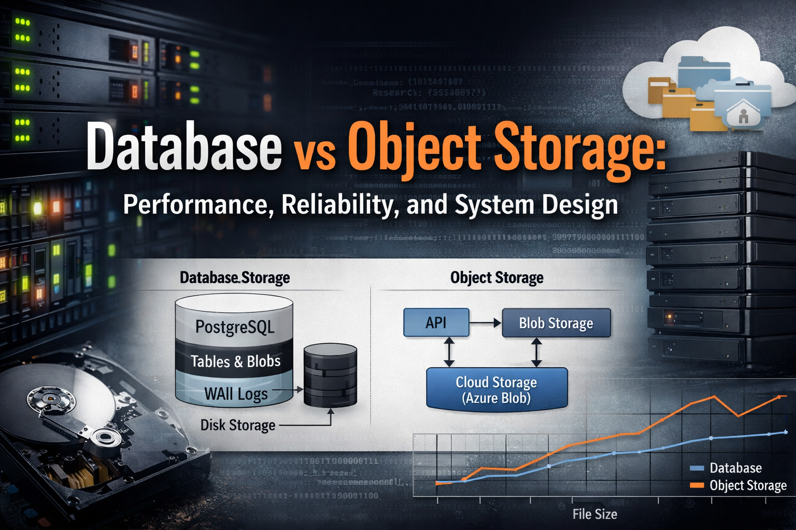

# File Storage System Architecture

A comprehensive research-oriented repository investigating file storage strategies in ASP.NET applications using PostgreSQL for metadata and Azure Blob Storage (via Azurite) for large binary objects.

## Purpose

This repository presents a complete, reproducible study of file storage architectures, examining the trade-offs between database storage and object storage for binary data. The research includes hardware-level considerations, performance benchmarks, statistical analysis, and practical implementation guidance.

## Scope

- **System Architecture**: PostgreSQL + Azurite (Azure Blob Storage emulation) integration
- **Performance Analysis**: Upload, read, backup, and latency benchmarks
- **Hardware Considerations**: IO operations, write amplification, cache effects, SSD/HDD implications
- **Real-World Context**: Azerbaijan-specific deployment scenarios and ownership models
- **Reproducibility**: Complete Docker-based environment for experiments

## Motivation

Modern web applications face critical decisions when storing files:
- Should large files be stored in the database or object storage?
- What are the performance implications at scale?
- How do hardware characteristics affect storage decisions?
- What are the operational and ownership considerations?

This research provides data-driven answers to these questions through systematic experimentation and analysis.

## Repository Structure

```
file-storage-system-architecture/
├── article/              # Research article in Markdown (14 sections)
├── code/
│   ├── api/             # ASP.NET Core API implementation
│   ├── database/        # PostgreSQL schema and migrations
│   └── benchmarks/      # Performance testing scripts
├── docker/              # Docker Compose and Dockerfiles
├── data/                # Raw and processed experimental data
└── scripts/             # Data collection and analysis scripts
```

## Quick Start

### Prerequisites

- Docker and Docker Compose
- .NET 8 SDK (for local development)
- PostgreSQL client tools (optional)

### Running the System

```bash
# Start all services
cd docker
docker-compose up -d

# API will be available at http://localhost:5001
# Swagger UI: http://localhost:5001/swagger
```


## Research Article

The complete research article is available in the `article/` directory:

- **00-abstract.md**: Executive summary
- **01-introduction.md**: Background and motivation
- **02-related-work.md**: Literature review
- **03-problem-statement.md**: Problem definition
- **04-hardware-storage.md**: Hardware internals (PostgreSQL pages, TOAST, WAL)
- **05-system-architecture.md**: System design
- **06-experimental-setup.md**: Methodology
- **07-implementation.md**: Code walkthrough
- **08-results.md**: Benchmark results and analysis
- **09-discussion.md**: Interpretation and insights
- **10-real-world-context.md**: Azerbaijan deployment scenarios
- **11-ownership-and-lessons.md**: Operational considerations
- **12-conclusion.md**: Summary and key findings
- **13-references.md**: Citations and resources

## Key Findings

The research demonstrates that:

- **Database storage** shows superior performance for small to medium files (<1MB) with peak throughput of 136.98 MB/s
- **Object storage** is competitive for larger files (>1MB) with peak throughput of 106.38 MB/s
- Both storage types achieve excellent download performance (up to 2500 MB/s)
- Database storage provides faster metadata operations

See `data/processed/benchmark-summary.md` for detailed findings and `data/raw/comprehensive-benchmark-*.json` for complete results.

## Reproducibility

All experiments are fully reproducible:

1. **Docker Environment**: Isolated, consistent runtime
2. **Automated Benchmarks**: Scripted performance tests
3. **Data Collection**: Automated metrics gathering
4. **Version Control**: All code and configurations tracked

Complete benchmark results and system metrics are available in the `data/` directory.

## Contributing

This is a research repository. For questions, issues, or contributions, please open an issue or discussion.

## License

See [LICENSE](LICENSE) file for details.

## Citation

If you use this research in your work, please cite:

```
File Storage System Architecture: A Comparative Study of Database vs. Object Storage
Elvin Suleymanov
2025
```

## Contact

For inquiries about this research, please open an issue in this repository.
